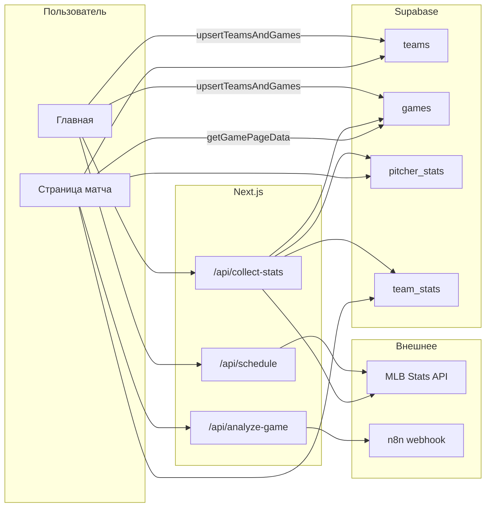

# Инструкция по логике проекта (текущее состояние)

Документ описывает, как устроено приложение: потоки данных, функции, запись в БД и взаимодействие частей. Актуально на момент составления по коду в `src/`.

---

## 1. Назначение системы

Приложение на **Next.js (App Router)** показывает **расписание MLB** за выбранную дату, сохраняет **команды и матчи** в **Supabase (PostgreSQL)**, по запросу подтягивает **статистику питчеров и команд** из **MLB Stats API** в кэш в БД, отображает **страницу матча** с данными из БД и отправляет **событие «проанализировать матч»** во внешний **n8n** через webhook.

---

## 2. Внешние зависимости

| Источник | Назначение |
|----------|------------|
| `https://statsapi.mlb.com/api/v1` | Расписание (`/schedule`), статистика питчера (`/people/{id}/stats`), статистика команды (`/teams/{id}/stats`) |
| Supabase | Клиент `@supabase/supabase-js`; таблицы `teams`, `games`, `pitcher_stats`, `team_stats` |
| `N8N_WEBHOOK_URL` (env) | POST с `{ mlbGameId }` при нажатии «Анализировать» на странице матча |

Переменные окружения для БД: `NEXT_PUBLIC_SUPABASE_URL`, `NEXT_PUBLIC_SUPABASE_ANON_KEY` (см. `src/lib/supabase.js`).

---

## 3. Схема таблиц (ожидаемая)

Кратко, как задокументировано в `src/lib/db.js`:

- **`teams`** — `id`, `mlb_id` (unique), `name`, `wins`, `losses`, `updated_at`
- **`games`** — `mlb_game_id` (unique), `date`, `home_team_id`, `away_team_id`, `home_pitcher_id`, `away_pitcher_id` (MLB id питчера, не FK), `series_game_number`, `games_in_series`, `status`
- **`pitcher_stats`** — уникальная пара `(mlb_pitcher_id, season)`; показатели ERA, WHIP, FIP, K/9 и т.д., `updated_at`
- **`team_stats`** — уникальная пара `(team_id, season)`; `team_id` — внутренний FK на `teams.id`; hitting/pitching агрегаты, `updated_at`

---

## 4. Порядок и содержание записи в БД

### 4.1. Цепочка «расписание → команды и матчи»

**Триггер:** на главной после «Получить матчи» клиент вызывает `GET /api/schedule?date=YYYY-MM-DD`, затем **`upsertTeamsAndGames(games)`** из `src/lib/db.js` (импорт в клиентском `page.jsx`).

**Порядок для каждого элемента массива `games`:**

1. **`upsertTeamRow(home_team)`** → `teams` (upsert по `mlb_id`), возвращается внутренний `id`.
2. **`upsertTeamRow(away_team)`** → `teams` (аналогично).
3. Формируется строка **`games`**: связи `home_team_id` / `away_team_id`, MLB id питчеров в `home_pitcher_id` / `away_pitcher_id` (из `team.pitcher.mlb_id`, если есть), серия, **`status` всегда `"scheduled"`** при upsert из этого пути.
4. Upsert в **`games`** по конфликту `mlb_game_id`.

Итог: за один проход по списку матчей дня таблицы **`teams`** и **`games`** обновляются; **`pitcher_stats` / `team_stats`** здесь не пишутся.

### 4.2. Цепочка «собрать статистику за день»

**Триггер:** кнопка «Получить статистику» на главной → `GET /api/collect-stats?date=...` → **`collectDayStats(date)`** в `db.js`.

**Шаг 1 — чтение:** выборка всех **`games`** с `date = выбранная дата` (поля с id питчеров и id команд).

**Шаг 2 — питчеры:**

- Собирается множество уникальных `home_pitcher_id` и `away_pitcher_id`.
- Для каждого MLB id питчера: если в **`pitcher_stats`** есть хотя бы одна строка с `updated_at` **новее 24 часов**, питчер **пропускается** (кэш).
- Иначе: **`getPitcherStats(pitcherId)`** (`mlb.js`) → MLB API → затем **`upsertPitcherStats`** → массовый upsert в **`pitcher_stats`** по `(mlb_pitcher_id, season)` (дедуп по ключу внутри одного вызова).

**Шаг 3 — команды:**

- Уникальные `home_team_id` / `away_team_id` (внутренние id из `teams`).
- Для каждой строки **`teams`**: берётся **`mlb_id`** команды.
- Если для пары `(team_id, season)` в **`team_stats`** уже есть запись с `updated_at` **новее 24 ч** и `season = TEAM_STATS_SEASON` (сейчас **2026**, константа в `mlb.js`), команда **пропускается**.
- Иначе: **`getTeamStats(mlbTeamId)`** → два запроса к MLB (hitting season + pitching season) → **`upsertTeamStats(internalTeamId, ...)`** → **`team_stats`** по `(team_id, season)`.

**Порядок по смыслу:** сначала обрабатываются все питчеры дня, затем все команды дня. Внутри каждой группы — итерация в произвольном порядке по Set/массиву, с пропуском «свежих» записей.

### 4.3. Что в БД не пишется

- **`GET /api/schedule`** — только ответ JSON клиенту; запись идёт отдельным вызовом `upsertTeamsAndGames` с клиента.
- **`POST /api/analyze-game`** — **не пишет в БД**; только проксирует `mlbGameId` в n8n.

---

## 5. Модули `src/lib`

### 5.1. `supabase.js`

- **`createSupabaseOrThrow()`** — создаёт клиент, если заданы URL и anon key.
- Экспорт **`supabase`** — ленивый Proxy: реальный клиент создаётся при первом обращении.

### 5.2. `mlb.js`

Константы: **`TEAM_STATS_SEASON`** (2026), **`MLB_STATS_API_BASE`**, **`FIP_CONSTANT`** (3.1) для расчёта FIP.

| Функция | Назначение |
|---------|------------|
| **`computeFip(st)`** (внутр.) | FIP из HR, BB, K, IP |
| **`parseStatNumber(value)`** (внутр.) | Безопасный разбор чисел из API |
| **`mapSplitToSeason(split)`** (внутр.) | Один split yearByYear → объект сезона для питчера |
| **`getPitcherStats(pitcherId)`** | `fetch` `/people/{id}/stats?stats=yearByYear&group=pitching` → `{ pitcherName, seasons[] }` |
| **`getTeamStats(teamId)`** | Параллельно hitting и pitching за `TEAM_STATS_SEASON` → агрегат с OPS, runs/game, LOB, WHIP, ERA команды, saves, blown saves |

### 5.3. `transformSchedule.js`

| Функция | Назначение |
|---------|------------|
| **`mapProbablePitcher`** (внутр.) | probablePitcher → `{ mlb_id, name }` |
| **`mapTeamSide`** (внутр.) | home/away: team id, name, wins/losses, pitcher |
| **`gameTimeUtcFromGameDate`** (внутр.) | ISO из `gameDate` |
| **`mapGame`** (внутр.) | Один game MLB → плоский объект для UI/БД |
| **`transformSchedule(mlbApiResponse)`** | Обход `dates[].games[]`, только **`gameType === "R"`** (регулярка) |

### 5.4. `db.js`

Внутренние: **`upsertTeamRow`**, **`mlbPitcherIdOrNull`**.

| Экспорт | Назначение |
|---------|------------|
| **`upsertTeamsAndGames(games)`** | Цикл: upsert двух команд, затем одна строка `games` |
| **`getGamesFromDB(date)`** | SELECT `games` за дату с join имён `teams` (home/away). **Сейчас нигде не вызывается из приложения** — готовый API для списка из БД |
| **`getGamePageData(mlbGameIdRaw)`** | Валидация id из URL; `games` по `mlb_game_id`; имена команд; `pitcher_stats` по id питчеров (сортировка сезонов по убыванию); `team_stats` за **`TEAM_STATS_SEASON`** для обеих команд |
| **`upsertPitcherStats(pitcherId, pitcherName, statsArray)`** | Маппинг массива сезонов → upsert `pitcher_stats` |
| **`upsertTeamStats(teamId, statsObj)`** | Одна строка `team_stats` (внутренний `team_id`) |
| **`collectDayStats(date)`** | Описана в §4.2 |

Константы: `GAME_STATUS_SCHEDULED`, окно свежести питчеров **24 ч**, паттерн id матча в URL.

### 5.5. `utils.js`

| Экспорт | Назначение |
|---------|------------|
| **`MOSCOW_TIMEZONE`** | `Europe/Moscow` |
| **`cn(...inputs)`** | `clsx` + `tailwind-merge` для классов |
| **`toMoscowTime(isoUtc)`** | Время матча для карточки расписания |
| **`formatDateMoscow(date)`** | Дата календаря в ru-RU / Москва |

---

## 6. API routes

| Маршрут | Метод | Логика |
|---------|-------|--------|
| **`/api/schedule`** | GET | Параметр `date` (или «сегодня» по календарю **America/New_York**). Запрос к MLB schedule с `hydrate=probablePitcher,linescore,team`. **`transformSchedule`**, фильтр: только матчи с **`game_time_utc` в будущем** относительно момента запроса. Кэш маршрута: **`revalidate = 60`** сек. |
| **`/api/collect-stats`** | GET | Параметр `date` или «сегодня» (NY). Вызов **`collectDayStats`**. Ответ: `pitchers_processed`, `teams_processed`. |
| **`/api/analyze-game`** | POST | Тело JSON: **`mlbGameId`**. Проверка **`N8N_WEBHOOK_URL`**. POST на webhook с `{ mlbGameId }`. Ошибки 400/500/502 по ситуации. |

---

## 7. Страницы и UI

### 7.1. `app/page.jsx` (главная, client)

- Обёртка **`AppShell`**, активная секция по умолчанию — расписание.
- Календарь (локальный день) → **`fetchGames`**: `/api/schedule` → при успехе **`upsertTeamsAndGames`** (ошибки upsert только в `console`) → список карточек, ссылка **`/game/{mlb_game_id}`**.
- **`fetchStats`**: `/api/collect-stats` для того же `date`, показ счётчиков обработанных питчеров/команд.
- Секции «Анализ» и «Статистика» в навбаре — заглушка «скоро».

### 7.2. `app/game/[id]/page.jsx` (server)

- **`getGamePageData(id)`**; при `null` — **`notFound()`**; при throw — карточка «Ошибка загрузки».
- Блоки статистики питчеров по сезонам и команд (OPS, runs/game за сезон из константы).
- **`AnalyzeGameButton`**.

### 7.3. `app/game/[id]/layout.jsx`

- **`AppShell`** + кнопка «Назад» на `/`.

### 7.4. `components/layout/AppShell.jsx` (client)

Контекст: активная секция сайдбара, сворачивание сайдбара. Экспорт **`SECTION_*`**, **`SECTION_TITLES`**, **`useAppShell`**.

### 7.5. `components/game/AnalyzeGameButton.jsx` (client)

POST на **`/api/analyze-game`** с `{ mlbGameId }`, состояния loading/error.

### 7.6. Прочие UI

`badge`, `button`, `card`, `calendar` — презентационные компоненты; логики БД/MLB нет.

### 7.7. `app/layout.jsx`

Корневой layout, шрифты, `globals.css`.

---

## 8. Сводная схема потоков

---

## 9. Важные нюансы для разработки

1. **Клиентский вызов `upsertTeamsAndGames`:** используется anon key Supabase в браузере — убедитесь, что RLS и политики в Supabase соответствуют желаемой безопасности.
2. **Синхронизация дат:** расписание на главной строится от **локального дня календаря** пользователя (`dateToScheduleParam`), а «сегодня» по умолчанию в API schedule/collect-stats — **America/New_York** (игровой день MLB). При несовпадении timezone возможны расхождения «какой это день».
3. **`collect-stats` без явной валидации формата `date` в route:** при неверной строке упадёт **`collectDayStats`** с ошибкой 500 (в отличие от `/api/schedule`, где формат проверяется).
4. **Страница матча** читает только то, что уже есть в БД; если матч не сохраняли через главную, **`getGamePageData`** вернёт `null` → 404.

---

*Документ отражает код репозитория; при изменении схемы БД или маршрутов его стоит обновить.*
